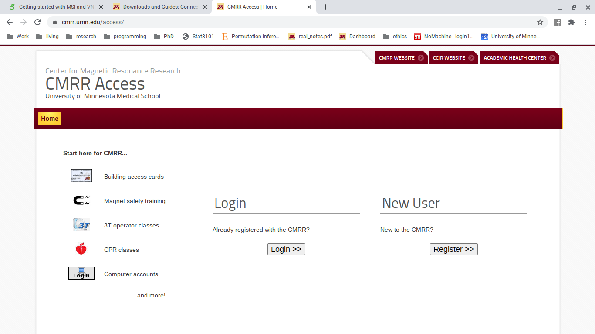

# Acccessing UMN's VPN and MSI or CMRR {#VPN}  
For MSI you can access with just Split Tunnel, and for CMRR you will need to use Departmental Pools $>$ Anyconnect-CMRR

1. To gain the rights to access the CMRR or MSI's VPN, you will need to fill out the request \href{https://www.cmrr.umn.edu/access/}{here} by clicking 'Register' and completing the form. the investigator on your project (i.e. Dr. Kate Cullen) will be notified and they can grant you access. 
    
    
```{r} 

```
{#fig:CMRR_login_regis}
  
\caption{Screenshot of CMRR page containing registration and login links.}

2. open anyConnect. In the 'connect to' box enter 'tc-vpn-1.vpn.umn.edu'. The group you  will connect to differs for MSI and CMRR. For MSI choose 'AnyConnect-UofMSplit'. For CMRR choose 'Department-Pools' then 'Anyconnect-CMRR' then type your credentials.
3. Tadah! you are now on the VPN. To confirm you are go to the following address www3.cmrr.umn.edu. If it loads, you were successful.

