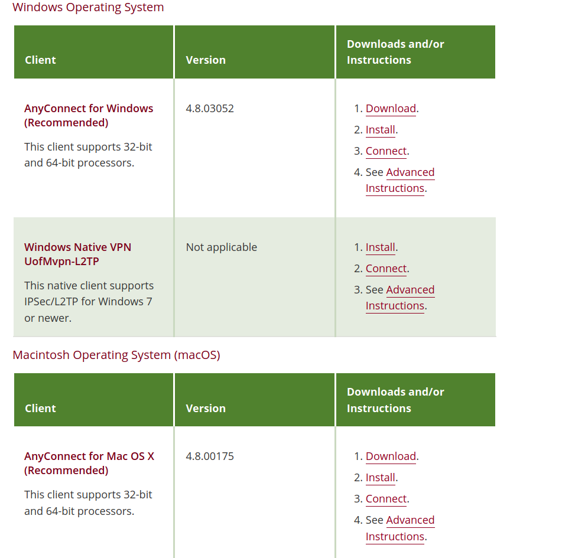
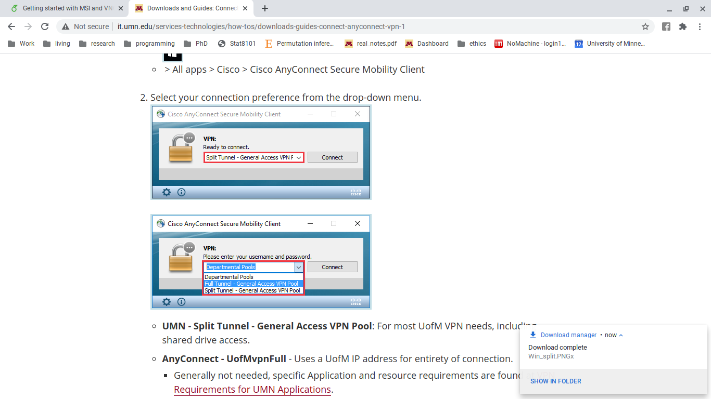

# Install VPN {#installvpn}
## System non-specific: Downloading AnyConnect for installation  

In order to access either MSI or CMRR from off-campus you must log in to MSI's network with a VPN (a VPN is a Virtual Private Network. It is how you can access the MSI remotely.) The university recommends using Cisco AnyConnect. Here are the steps to set up a Cisco VPN. The hyperlink will also be in the footnotes (https://it.umn.edu/services-technologies/virtual-private-network-vpn). Follow the URL hyperlink in the previous sentence. You will be brought to a page that all the downloads for different operating systems as shown below. Locate the download for your operating system and click "Download". The download file should take a few seconds to fully download. The next steps will depend on the OS you are using.

```{r} 

```
        \caption{An image of the website that the above url links to. Notice that downloads are available for different operating systems. make sure to choose the download for the correct operating system.}
        \label{fig:AnyCon_download}

## Windows  
### Installing AnyConnect
1.  Right click the zipped file that was downloaded to your Downloads folder and 'Extract all'. 
2.  Open the new file folder of the same name of the one just unzipped. Right click the file called 'Install-batch' and select 'Run as administrator'. (Note: you will need to have administrative rights to run this command)
3.  A pop up will display the installation progress and then eventually when the process is complete.

### Connecting to UMN VPN
1. Navigate to Cisco AnyConnect Secure Mobility Client from the Start menu. Start menu button in Windows 10 > All apps > Cisco > Cisco AnyConnect Secure Mobility Client
    
    ```{r} 

```
\caption{Screenshot of choosing the two optinos necessary to access the MSI (top) and CMRR (bottom) VPN's.}
\label{fig:Win_any}

2. Select your connection preference from the drop-down menu. 
  a. UMN - Split Tunnel - for MSI.
  b. Departmental Pools - For CMRR -> Select your specific departmental pool after clicking 'Connect'.
3.  Click connect, enter credentials then ok. you are connected.


## Mac
### Installing AnyConnect
1. Find and open the anyconnect-mac-[version]-repack-signed.pkg installer package in your Downloads folder.
2. Follow the steps in the UMN Cisco AnyConnect Installer until the installation is complete. See the General tab in System Preferences to Allow the Cisco Extension.

### Connecting to Umn VPN
1. Navigate to Cisco AnyConnect Secure Mobility Client from file 'Finder'
2. Select your connection preference from the drop-down menu. See Fig. \ref{fig:Win_any}
  a. UMN - Split Tunnel - for MSI.
  b. Departmental Pools - For CMRR -> Select your specific departmental pool after clicking 'Connect'.
3. Click connect, enter credentials then ok. you are connected.

## Linux
### Installing AnyConnect
1. Before moving forward with the installation open terminal and run the following commands. to make sure linux is up to date for the installation and has all of the necessary dependencies.

caption=Bash commands to update and install dependencies for the VPN.
"$ sudo apt-get update"  
"$ sudo apt-get install lib32z1 lib32ncurses6"  

2. The package will be downloaded as a .tar.gz file extension (called a tarball). You can unzip the tarball in one of two ways. 1) You can naviagte to Dowloads in your file manager, right click and choose extract here. 2) Using command line you can use the following commands. 
    
caption=the first line changes directories (cd) to your downloads folder. The dollar sign (\$) is not something you have to type in it just appears at the beginning of the command prompt after listing your current directory. The tilda (~) is a reference to your home directory. The second line contains the necessary information for unzipping the tar file. xvfz are 'flags' that tell tar exactly what you want to do. x- means you want to e(x)tract the folder. v- verbose, so it will show you every output from the unzipping process. f- means you're going to specify the tar file name to be unzipped. z- specifies that it is a gzip style compression (we know this given the .gz extension). The asterisk (*) is a wild card that can account for any sequence of characters. It is a good idea to manually enter the file name that appears in your Downloads folder to avoid any mishaps just in case you have multiple tarball files.
"$ cd ~/Downloads"  
"$ tar xvfz anyconnect*.tar.gz"  
    
4. Unzipping the tarball will leave a directory with the same name as the tarball file. Navigate into this directory either in the file manager or via command line using the 'cd' command followed by the name of the directory. Then, navigate to the vpn folder.
    
5. If you're using the file manager, write click the file called 'vpn\_install.sh' and run it. This is a shell script (.sh) that will install the vpn for you. Or else, in the command line run the line below. You will be prompted to fill out your password to grant root access via sudo. Accept the licensing agreement and it will install. At the end of the installation it should tell you that it is done.  
    
caption=The command to run the installastion script from terminal. sudo grants the computer root access allowing it to properly install.
"$ sudo vpn_./install.sh"
    
6. Next, in the unzipped folder navigate to the directory called 'dart'. install dart via command line using "sudo ./dart\_install.sh."