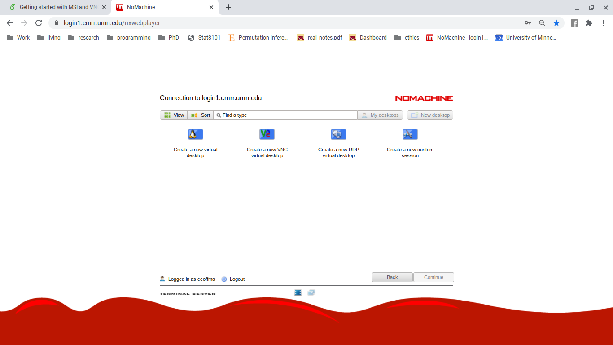

# CMRR  
## First time CMRR users  
1. You will need to set up your CMRR Password and figure out your login id. To do this follow \href{https://www.cmrr.umn.edu/access/}{this link.} This time, instead of clicking 'Register' click 'Login' and login with your x500 (normal UMN credentials).
2. Then in the tabs on the CMRR page click 'My Profile' then 'Change CMRR Server Password'.
3. First, write down your login ID
4.  Then, enter a new password (this will be used only when accessing CMRR machines through NoMachine. More on that later).
5. it will take a few minutes for your password to update and a day or two for your initial access to be granted to the CMRR computers.

## Accessing CMRR  
For CMRR questions go \href{https://www.cmrr.umn.edu/computeruser/}{here}.
1. Follow \href{https://login1.cmrr.umn.edu/nxwebplayer}{this link.} This will always be how you access CMRR computers, so bookmark it.
2. Enter the credentials that you just set up for CMRR
3. Select 'Create a new virtual desktop' (The left most option)
4. Then you are in the CMRR login computer!
```{r} 

```
\caption{Screenshot of NoMachine. Here you should select the left most option to create a new virtual desktop. This image has a penguin because I was running Linux at the time, your's might not necessarily have a penguin on it.}
\label{fig:NX_create_desktop}

5. To access a computer that has processing power use the following command 
caption=Code to create a secure shell connection (ssh) to another computer on CMRR.
"$ssh <CMRRusername>\@lnpi15.cmrr.umn.edu"
    
For example,  
"$ ssh ccoffma\@lnpi15.cmrr.umn.edu"
6. First time users will need to allow the key.
7. Enter your CMRR credentials.
